# 📊 Visual Diagrams

**Architecture, flows, and system diagrams for GAS-Agent**

All diagrams use [Mermaid](https://mermaid.js.org/) format, which renders natively in GitHub and many markdown viewers.

---

## System Architecture

### GAS-Agent Overall Architecture

```mermaid
graph TB
    User[User/Developer] -->|Describes Project| Orchestrator[🎯 Orchestrator]

    Orchestrator -->|Analyzes| Analysis[Requirements Analysis]
    Analysis -->|Selects| Specialists[12 Specialists]

    Specialists --> Security[🔒 Security Engineer]
    Specialists --> Platform[⚙️ Platform Engineer]
    Specialists --> AI[🤖 AI Integration]
    Specialists --> Integration[🔗 Integration Engineer]
    Specialists --> Data[📊 Data Engineer]
    Specialists --> BC[💼 BC Specialist]
    Specialists --> More[... 6 more]

    Security -->|Loads| DeepDocs[Deep Documentation<br/>32 files]
    Platform -->|Loads| DeepDocs
    AI -->|Loads| DeepDocs
    Integration -->|Loads| DeepDocs
    Data -->|Loads| DeepDocs
    BC -->|Loads| DeepDocs

    DeepDocs -->|Provides Patterns| Implementation[Implementation]
    Implementation -->|Validates| Validation[Quality Validation]
    Validation -->|Passes| Output[✅ Production Code]
    Validation -->|Fails| Iteration[Iteration & Fixes]
    Iteration -->|Retry| Implementation

    Output --> Testing[🧪 Tests]
    Output --> Deployment[🚀 Deployment]

    style Orchestrator fill:#ff6b6b
    style Output fill:#51cf66
    style Validation fill:#ffd43b
```

### Progressive Disclosure Architecture

```mermaid
graph LR
    Task[User Task] -->|Load| Overview[Specialist Overview<br/>~150 lines]
    Overview -->|Decision Tree| Deep1[Deep File 1<br/>400-800 lines]
    Overview -->|Decision Tree| Deep2[Deep File 2<br/>400-800 lines]
    Overview -->|Decision Tree| Deep3[Deep File 3<br/>400-800 lines]

    Deep1 -->|Code Examples| Implementation
    Deep2 -->|Code Examples| Implementation
    Deep3 -->|Code Examples| Implementation

    Implementation[Implementation] -->|Result| Complete[✅ Complete Solution]

    Full[Full Docs<br/>18,637 lines] -.->|VS| Loaded[Loaded Docs<br/>~1,500 lines]

    Loaded -->|Savings| Savings[74-85% Context<br/>Savings]

    style Savings fill:#51cf66
    style Overview fill:#ffd43b
    style Complete fill:#51cf66
```

---

## OAuth2 Authentication Flow

### Authorization Code Flow

### Token Refresh Flow

```mermaid
flowchart TD
    Start[API Call Needed] --> CheckCache{Token in<br/>CacheService?}

    CheckCache -->|Yes| UseToken[Use Cached Token]
    CheckCache -->|No| CheckRefresh{Refresh Token<br/>in Properties?}

    CheckRefresh -->|Yes| RefreshToken[Call Token Endpoint<br/>with refresh_token]
    CheckRefresh -->|No| Error1[❌ Not Authorized<br/>Run authorize first]

    RefreshToken --> Success{Status<br/>200?}
    Success -->|Yes| CacheNew[Cache New Token<br/>TTL: expires_in - 300s]
    Success -->|No| Error2[❌ Refresh Failed<br/>Re-authorize needed]

    CacheNew --> UpdateRefresh{New refresh_token<br/>provided?}
    UpdateRefresh -->|Yes| StoreNew[Update PropertiesService]
    UpdateRefresh -->|No| Skip[Skip]

    StoreNew --> UseToken
    Skip --> UseToken

    UseToken --> MakeCall[Make API Call]
    MakeCall --> CheckStatus{Status?}

    CheckStatus -->|200| Done[✅ Success]
    CheckStatus -->|401| ClearCache[Clear Cache<br/>Token Invalid]
    CheckStatus -->|429| RateLimit[⚠️ Rate Limited<br/>Retry with Backoff]
    CheckStatus -->|5xx| ServerError[⚠️ Server Error<br/>Retry]

    ClearCache --> Start
    RateLimit --> MakeCall
    ServerError --> MakeCall

    style Done fill:#51cf66
    style Error1 fill:#ff6b6b
    style Error2 fill:#ff6b6b
    style UseToken fill:#74c0fc
    style CacheNew fill:#ffd43b
```

---

## Data Flow Diagrams

### Business Central to Sheets Sync

```mermaid
flowchart TB
    Trigger[⏰ Hourly Trigger] --> Start[syncBCOrders]

    Start --> GetLastSync[Get Last Sync Timestamp<br/>from PropertiesService]

    GetLastSync --> CheckCache{Check<br/>CacheService}
    CheckCache -->|Hit| CachedData[Return Cached Orders]
    CheckCache -->|Miss| FetchAPI[Fetch from BC API]

    FetchAPI --> OAuth[Get OAuth2 Token]
    OAuth --> BuildQuery[Build OData Query<br/>$filter, $select, $expand]
    BuildQuery --> APICall[UrlFetchApp.fetch]

    APICall --> Retry{Success?}
    Retry -->|No| Backoff[Exponential Backoff]
    Backoff --> APICall
    Retry -->|Yes| CacheResponse[Cache Response<br/>TTL: 1 hour]

    CacheResponse --> Transform[Transform BC Data]
    CachedData --> Transform

    Transform --> Validate[Validate Each Order]
    Validate --> Split{Valid?}

    Split -->|Yes| ValidOrders[Valid Orders List]
    Split -->|No| InvalidOrders[Invalid Orders List]

    ValidOrders --> BatchWrite[Batch Write to Sheets<br/>setValues]
    InvalidOrders --> LogErrors[Log Errors]

    BatchWrite --> UpdateSync[Update Last Sync<br/>in PropertiesService]
    LogErrors --> EmailAlert[📧 Send Error Email]

    UpdateSync --> Done[✅ Sync Complete]
    EmailAlert --> Done

    style Done fill:#51cf66
    style ValidOrders fill:#51cf66
    style InvalidOrders fill:#ff6b6b
    style CacheResponse fill:#ffd43b
```

### Multi-Level Caching Strategy

---

## AI Integration

### Claude Document Processing Pipeline

### Token Optimization Strategy

---

## System Design Patterns

### Repository Pattern Architecture

### Error Handling Flow

---

## Deployment Pipeline

### CI/CD Flow

```mermaid
flowchart LR
    Dev[👨‍💻 Developer] -->|git push| GitHub[GitHub Repository]

    GitHub -->|Webhook| Actions[GitHub Actions]

    Actions --> Lint[ESLint Check]
    Actions --> Test[Run Tests]
    Actions --> Build[Build Check]

    Lint --> ChecksPassed{All Checks<br/>Passed?}
    Test --> ChecksPassed
    Build --> ChecksPassed

    ChecksPassed -->|No| Failed[❌ Build Failed<br/>Notify Developer]
    ChecksPassed -->|Yes| Branch{Which<br/>Branch?}

    Branch -->|staging| DeployStaging[Deploy to Staging]
    Branch -->|main| DeployProd[Deploy to Production]
    Branch -->|other| Skip[Skip Deploy]

    DeployStaging --> StagingTests[Run Integration Tests]
    StagingTests --> StagingHealth[Health Check]

    DeployProd --> ProdDeploy[clasp deploy]
    ProdDeploy --> ProdHealth[Health Check]
    ProdHealth --> Monitor[Setup Monitoring]

    Monitor --> Metrics{Metrics<br/>OK?}
    Metrics -->|Yes| Success[✅ Deploy Success]
    Metrics -->|No| Rollback[🔄 Auto Rollback]

    Rollback --> Alert[📧 Alert Team]

    StagingHealth --> StagingSuccess[✅ Staging Updated]
    Success --> Release[Create GitHub Release]

    Failed -.-> Dev
    Alert -.-> Dev

    style Success fill:#51cf66
    style Failed fill:#ff6b6b
    style Rollback fill:#ffd43b
```

---

## Performance Optimization

### Before vs After Optimization

```mermaid
graph TB
    subgraph "❌ Before Optimization - 45 seconds"
        B1[Load 10K Orders] --> B2[For Each Order]
        B2 --> B3[getValue Row-by-Row<br/>10,000 API calls]
        B3 --> B4[Process]
        B4 --> B5[setValue Row-by-Row<br/>10,000 API calls]
        B5 --> B6[❌ Slow: 45s<br/>❌ High Quota Usage]
    end

    subgraph "✅ After Optimization - 5 seconds"
        A1[Load 10K Orders] --> A2[Batch: getValues<br/>1 API call]
        A2 --> A3[Process All in Memory]
        A3 --> A4[Batch: setValues<br/>1 API call]
        A4 --> A5[✅ Fast: 5s<br/>✅ Low Quota Usage]
    end

    B6 -.->|9x faster| A5

    style B6 fill:#ff6b6b
    style A5 fill:#51cf66
```

---

## Monitoring Dashboard

### System Health Overview

```mermaid
graph TB
    Monitor[Monitoring System] --> Metrics[Collect Metrics]

    Metrics --> OAuth[OAuth2 Status]
    Metrics --> API[External API Status]
    Metrics --> Cache[Cache Hit Rate]
    Metrics --> Performance[Performance Metrics]
    Metrics --> Errors[Error Rate]

    OAuth --> OAuth_Check{Token<br/>Valid?}
    OAuth_Check -->|Yes| OAuth_OK[✅ OK]
    OAuth_Check -->|No| OAuth_Alert[🚨 Alert]

    API --> API_Check{Response<br/>Time < 3s?}
    API_Check -->|Yes| API_OK[✅ OK]
    API_Check -->|No| API_Alert[🚨 Alert]

    Cache --> Cache_Check{Hit Rate<br/>> 70%?}
    Cache_Check -->|Yes| Cache_OK[✅ OK]
    Cache_Check -->|No| Cache_Warn[⚠️ Warning]

    Performance --> Perf_Check{Execution<br/>< 10s?}
    Perf_Check -->|Yes| Perf_OK[✅ OK]
    Perf_Check -->|No| Perf_Warn[⚠️ Warning]

    Errors --> Error_Check{Error Rate<br/>< 1%?}
    Error_Check -->|Yes| Error_OK[✅ OK]
    Error_Check -->|No| Error_Alert[🚨 Alert]

    OAuth_Alert --> Notify[📧 Send Alert]
    API_Alert --> Notify
    Error_Alert --> Notify

    OAuth_OK --> Dashboard[Health Dashboard]
    API_OK --> Dashboard
    Cache_OK --> Dashboard
    Perf_OK --> Dashboard
    Error_OK --> Dashboard
    Cache_Warn --> Dashboard
    Perf_Warn --> Dashboard

    Dashboard --> Report[Daily Report]

    style OAuth_OK fill:#51cf66
    style API_OK fill:#51cf66
    style Cache_OK fill:#51cf66
    style Perf_OK fill:#51cf66
    style Error_OK fill:#51cf66
    style OAuth_Alert fill:#ff6b6b
    style API_Alert fill:#ff6b6b
    style Error_Alert fill:#ff6b6b
    style Cache_Warn fill:#ffd43b
    style Perf_Warn fill:#ffd43b
```

---

## Usage Instructions

### Viewing Diagrams

These Mermaid diagrams render automatically on:
- ✅ GitHub
- ✅ GitLab
- ✅ VS Code (with Mermaid extension)
- ✅ Many documentation platforms

### Editing Diagrams

1. Use [Mermaid Live Editor](https://mermaid.live/) for visual editing
2. Copy updated code back to this file
3. Commit changes

### Adding New Diagrams

Follow Mermaid syntax:
- `flowchart` / `graph` - For flow diagrams
- `sequenceDiagram` - For sequence diagrams
- `classDiagram` - For class diagrams
- `stateDiagram` - For state machines

---

**Visual understanding accelerates learning! 📊**

**Version**: 1.0
**Last Updated**: November 2025
